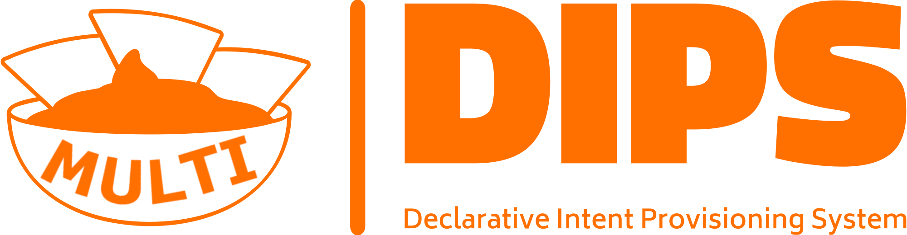

<picture>
    <source media="(prefers-color-scheme: dark)" srcset="img/logo-dark.png">
</picture>

**MULTIDIPS** is Prolog tool that exploits a declarative methodology for modelling and processing VNF-based service provisioning intents. 

MULTIDIPS enables users (i.e. application providers) to specify their desired VNF chain requirements in a high-level language that captures their intent, such as the type of service to be provided, possible location constraints (e.g. at the _edge_), Quality of Service (QoS) (e.g. _latency_ and _bandwidth_), but also non-functional requirements (e.g. _privacy_ and _logging_). DIPS leverages Prolog inference to translate intents into provisioning specifications.
